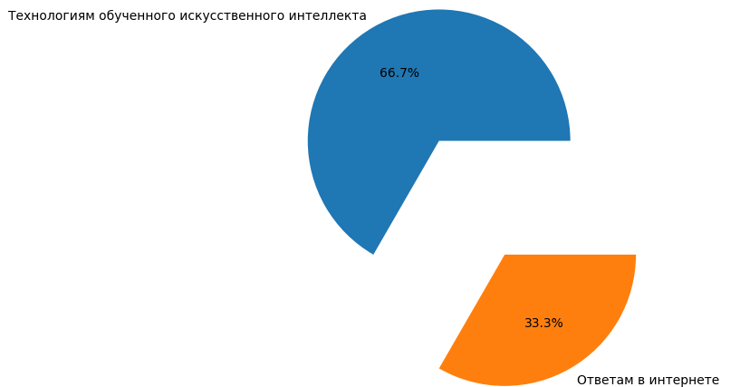
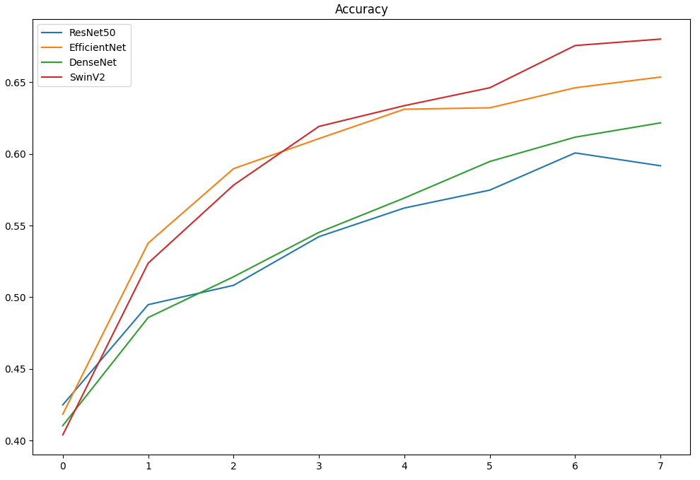
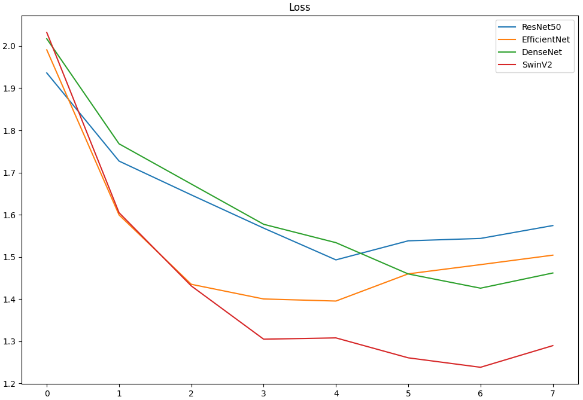
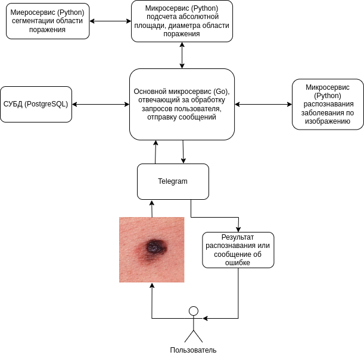
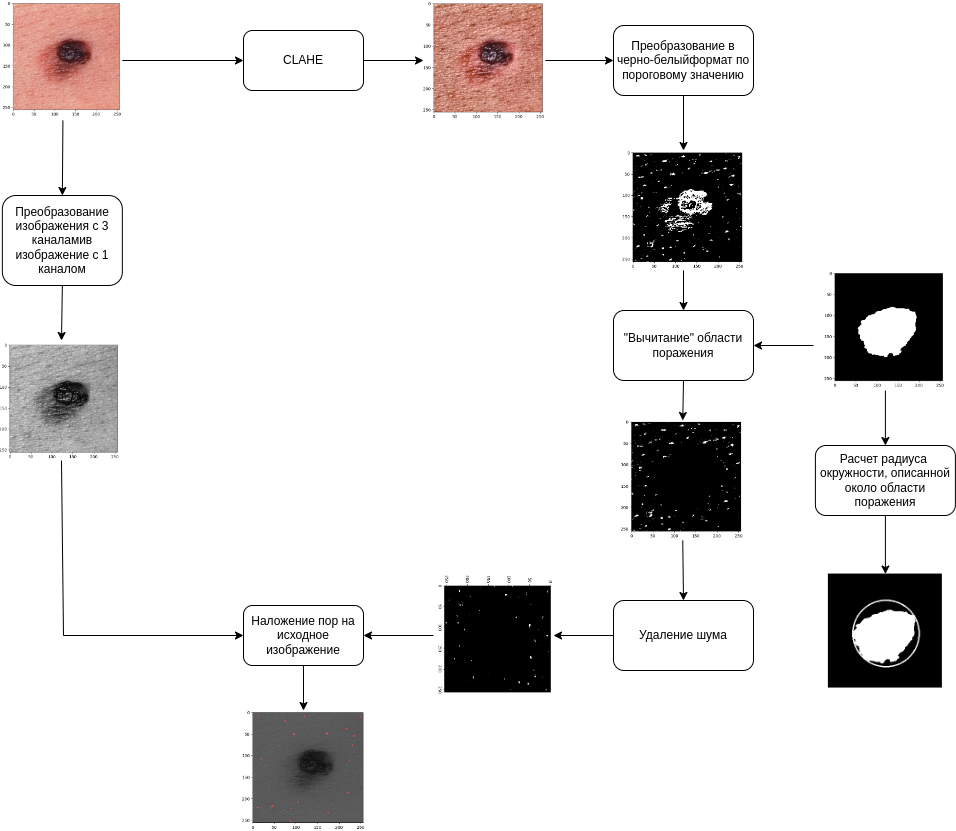

# Итоговый проект продвинутого потока DLS студента Киселева Виктора
Тема:телеграм-бот классификации кожного заболевания с определением диаметра области поражения (в сантиметрах)

# Описание
1. Результаты опроса для анализа целевой аудитории:
Перед началом разработки проекта был проведен небольшой опрос с 83 респондентами с целью выявления потребности в данном сервисе

Результаты опроса показали, что люди больше доверяют технологиям ИИ, чем ответам в интернете. Подробное описание опроса и его анализ можно посмотреть в РПЗ

2. Выбор архитектуры нейронной сети для классификации кожных заболеваний на изображении

В итоге была выбрана архитектура SwinV2

3. Выбор архитектуры нейронной сети для сегментации области кожного заболевания на изображении

Была выбрана архитектура Unet, которая обладает наилучшими показателем точность/вычислительные затраты в сфере сегментации кожных заболеваний.

4. Архитектура Телеграм-бота
В проекте используется микросервисная архитектура, общение между микросервисами осуществляется при помощи GRPC:

# Используемые технологии
GRPC, PyTorch, Telegram API, OpenCV

# Схема преобразования изображения для вычисления площади и диаметра области поражения

# Демонстрация:

https://drive.google.com/file/d/1Sw30nP8-eZutXRDIBr42dUASQsWCvAaO/view?usp=sharing

# Инструкция по запуску:

* Классификация изображений:

Генерация файлов для работы с proto для бэк-енда:
(Back-end folder)
protoc -I ../GRPC/DiseaseClassification/ --go_out=../Back-end/clients/GRPC/DiseaseClassification --go-grpc_out=../Back-end/clients/GRPC/DiseaseClassification ../GRPC/DiseaseClassification/image.proto

Генерация файлов для работы с proto для микросервиса:
(DiseaseClassification folder)
python -m grpc_tools.protoc -I ../../GRPC/DiseaseClassification/ --python_out=../../GRPC/DiseaseClassification/ML --grpc_python_out=../../GRPC/DiseaseClassification/ML ../../GRPC/DiseaseClassification/image.proto

* Подсчет пор:

Генерация файлов для работы с proto для бэк-енда:
(Back-end folder)
protoc -I ../GRPC/CountPores/ --go_out=../Back-end/clients/GRPC/CountPores --go-grpc_out=../Back-end/clients/GRPC/CountPores ../GRPC/CountPores/countPores.proto

Генерация файлов для работы с proto для микросервиса:
(PoresSegmentation folder)
python -m grpc_tools.protoc -I ../../GRPC/CountPores/ --python_out=../../GRPC/CountPores/ML --grpc_python_out=../../GRPC/CountPores/ML ../../GRPC/CountPores/countPores.proto

* Сегментация области поражения заболевания

Генерация файлов для работы с proto для сервера:
(LesionSegmentation folder)
python -m grpc_tools.protoc -I ../../GRPC/LesionSegmentation/ --python_out=../../GRPC/LesionSegmentation/ML --grpc_python_out=../../GRPC/LesionSegmentation/ML ../../GRPC/LesionSegmentation/lesionSegmentation.proto

# Источники:
* [Данные от размерах пор на коже человека](https://www.ncbi.nlm.nih.gov/pmc/articles/PMC4337418/)
* [Набор данных для обучения модели классификации](https://dermnet.com/)
* [Данные о сегментации меланом](https://paperswithcode.com/dataset/ph2)
* [Преобразование изображения для выделения пор](https://onlinelibrary.wiley.com/doi/full/10.1111/srt.13060)
